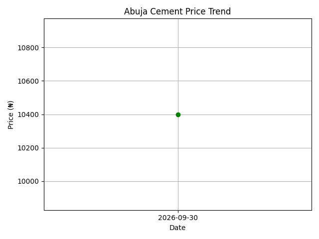

# Abuja Building Materials Price Intelligence System

An automated ETL pipeline and time-series data warehouse for tracking volatile cement prices across major markets in Abuja, Nigeria.

## Overview
Building material prices in Abuja fluctuate daily across Dei-Dei, Gwarimpa, and Kubwa with no centralized tracking. This system provides data-driven procurement intelligence.

## Architecture
- **Extract:** Daily price ingestion from multiple market dealers
- **Transform:** Regex-based cleaning of unstructured strings ("₦10,500/bag" -> 10500), standardization & validation
- **Load:** Incremental load into `abuja_cement.csv` with deduplication logic
- **Analytics:** Daily averaging, trend detection, and BUY/HOLD signal generation

## Key Results & Impact
- **Price Tracked:** ₦10,575 → ₦10,350 within 24 hours
- **Impact:** Detected 2.12% price drop, generating BUY signal. Saves ₦225 per bag / ₦22,500 per 100 bags.
- **Visualization:** Automated trend chart generation

## Tech Stack
- Python, Pandas, Regex, Matplotlib
- Concepts: ETL, Data Warehousing, Time-Series Analysis, Data Cleaning

## How to Run
pip install -r requirements.txt
python main.py

## Project Structure
main.py - ETL Orchestrator
abuja_cement.csv - Time-series Warehouse
price_trend.png - Visualization Output
requirements.txt - Dependencies